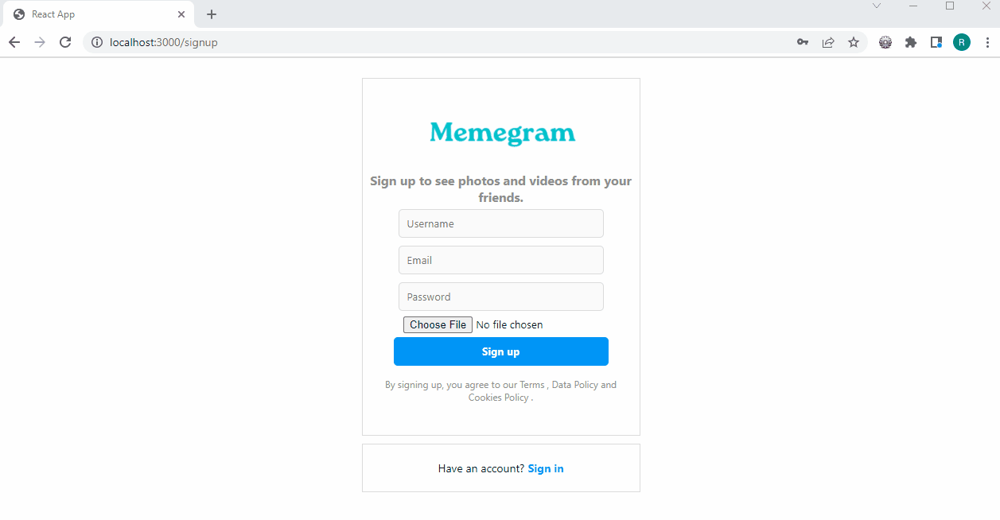
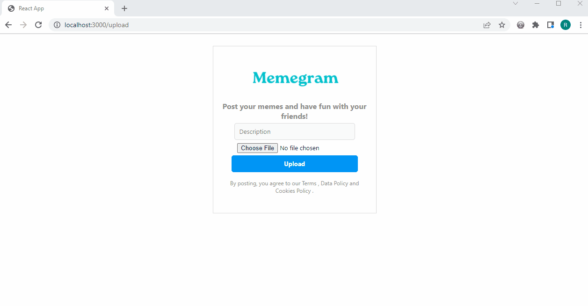
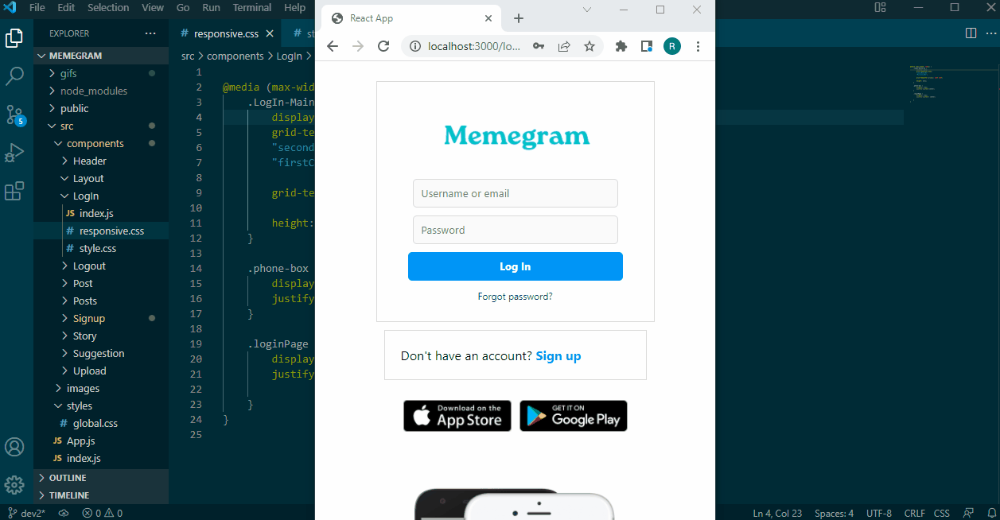
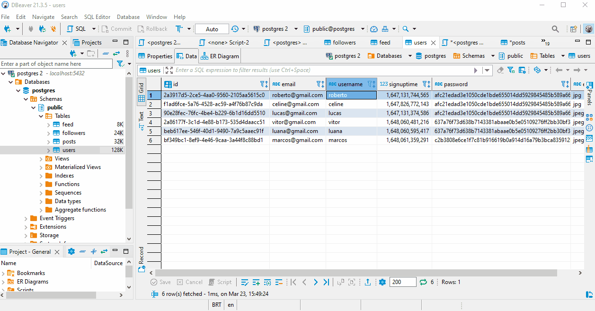

<h1 align="center">
 
  Welcome to the project: Memegram
 
</h1>

This is a Full Stack Instagram clone project for sharing memes with RESTful API developed with React.JS, Node.JS, Express and PostgreSQL.

<strong>
This repository is the Back-End part.
</strong>

  ✔️ To the suggestions part, I consumed the Github API so my followers show up as suggestion.

  ✔️ I used the express-js to implement the REST API and the HTTP methods POST (to insert new data) and GET (to retrieve data).

  ✔️ To store data, we used PostgreSQL, which is a relational database. It is a proven database technology that supports transactions.

  ✔️ On my database I created the tables users, followers and posts and applied the essential tools such as Primary Key, Foreign Key, Index and Inner Join.

  ✔️ Primary key was made to create an unique identifier for the entity. It can be simple or composed.

  ✔️ I used Foreign Key to refer an identifier from an existing table. It ensures that only existing data can be inserted.

  ✔️ Index was used to sort the data in order to have a faster lookup.

  ✔️ Inner Join was used because it matches data from one table with the foreign table based on the equality of the foreign key with the original table, in order to lookup additional information.

  ✔️ I also used sha256 to not expose the raw password in the database

  ✔️ I used the post retrieval pagination in order to not overload the server, I used SQL offset and limit to retrieve batches of results.

  ✔️ And I used Postman to try my project while I was developing

## 📲 Creating a new account 

  

 

## 📲 Logging into my account

  

## 📲 Uploading a new meme

  

## 📲 Responsive Web Design

  

## 📲 Back-End

  

## 🚀 Technologies

This project was developed with the following technologies:

- ✔️ React.JS

- ✔️ Node.JS

- ✔️ PostgreSQL

- ✔️ Express

---

Made with 💜 by Roberto Teixeira 👋 [See my linkedin](https://www.linkedin.com/in/roberto-teixeira-developer/)